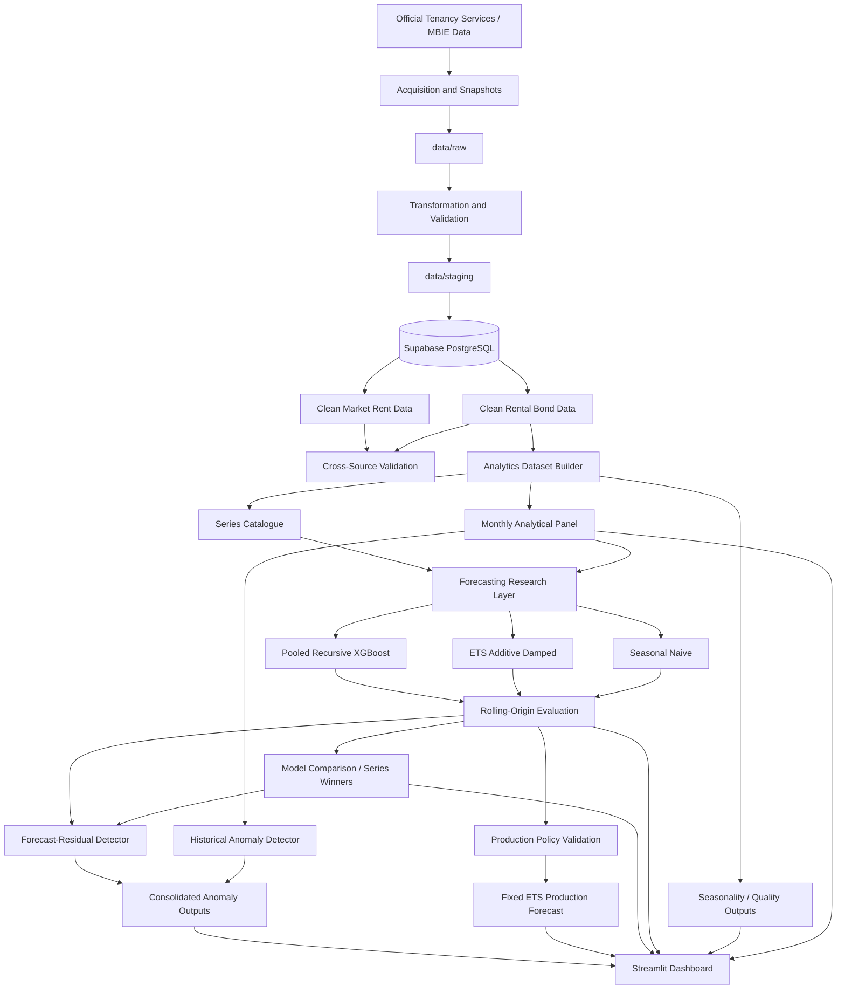
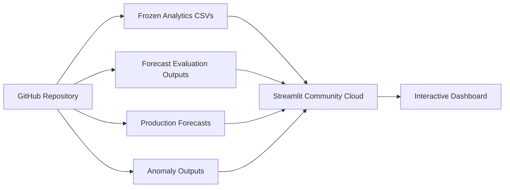

# System Architecture

## Purpose

This document describes the implemented architecture of the **New Zealand Rental Market Analytics and Forecasting Platform**.

The system separates source acquisition, transformation, database persistence, analytical preparation, forecasting, anomaly detection, and dashboard presentation. Research model evaluation is also kept separate from the production forecasting policy.

## 1. Architecture overview



The deployed assessment version uses the same validated outputs but does not rerun the upstream pipeline at runtime.

## 2. Source layer

The project uses official Tenancy Services / MBIE sources:

- Rental Bond data;
- Market Rent statistics.

Rental Bond data is the primary source used to build the final monthly analytical panel.

Market Rent is acquired and stored independently and is used as supporting evidence, including cross-source validation against Rental Bond regional aggregates.

No private listing scraping is used.

Recent observations affected by the 2025–2026 Bond Hub migration retain explicit provisional-source metadata.

## 3. Acquisition and raw snapshots

Acquisition code is under:

```text
src/rmp/acquisition/
```

Main entry points:

```text
scripts/acquire_market_rent.py
scripts/acquire_rental_bond.py
```

Market Rent is obtained through the official API. Rental Bond data is downloaded from official Tenancy Services files.

Raw snapshots are stored under:

```text
data/raw/
```

Snapshot metadata includes retrieval details, source information, checksums, and provisional status where applicable. Raw files are not modified by later stages.

## 4. Transformation and validation

Transformation and validation code is under:

```text
src/rmp/transform/
src/rmp/validation/
```

Main scripts:

```text
scripts/transform_market_rent.py
scripts/transform_rental_bond.py
scripts/validate_cross_source.py
```

The staging layer standardises:

- dates;
- geography identifiers and names;
- metrics;
- numeric values;
- source metadata;
- provisional status.

Intermediate files are stored under:

```text
data/staging/
```

Validation includes required fields, data types, lineage, checksum integrity, geographic consistency, and cross-source comparison.

## 5. Persistence layer

Structured source data is stored in PostgreSQL hosted through Supabase.

Relevant implementation:

```text
src/rmp/db/
src/rmp/config.py
db/migrations/
```

Logical schemas:

```text
raw
clean
```

Key tables include:

```text
raw.snapshots
clean.geo_areas
clean.rental_metrics
clean.market_rent
clean.rental_bond
```

Clean records retain `source_snapshot_id`, linking them back to the source snapshot.

The lineage is:

```text
official source
→ raw snapshot
→ staging transformation
→ database load
→ analytical output
```

Supabase is part of the ETL and persistence architecture, but it is not queried by the deployed Streamlit app at runtime.

## 6. Analytical dataset layer

Analytics code is under:

```text
src/rmp/analytics/
```

The main build script is:

```text
scripts/build_analytics_dataset.py
```

It loads validated Rental Bond observations from PostgreSQL and builds the processed analytical datasets.

Primary output:

```text
data/processed/analytics/monthly_panel.csv
```

Current scope:

- 64,956 monthly observations;
- 164 analytical series;
- February 1993 to July 2026;
- Region and Territorial Authority geographies;
- `median_rent` and `bonds_lodged` metrics.

Core fields include:

```text
series_id
period_date
geography_level
location_id
location_name
metric
value
source_snapshot_provisional
source_snapshot_id
```

The series catalogue:

```text
data/processed/analytics/series_catalog.csv
```

stores completeness and modelling-readiness information.

There are 164 analytical series, of which 132 are initially forecast-eligible. Two duplicate Auckland Territorial Authority series are then removed from the modelling scope, leaving 130 forecast series.

## 7. Forecasting research layer

Forecasting code is under:

```text
src/rmp/forecasting/
```

Candidate models:

1. Seasonal Naive
2. ETS additive damped
3. pooled recursive XGBoost

Main runners:

```text
scripts/run_seasonal_naive.py
scripts/run_ets.py
scripts/run_xgboost.py
scripts/build_model_comparison.py
```

Seasonal Naive provides the baseline. ETS uses additive trend, additive seasonality, and a damped trend. XGBoost uses pooled lagged, rolling, calendar, and geography-aware features.

## 8. Time-series evaluation

Candidate models are evaluated with expanding-window rolling-origin validation.

Configuration:

```text
12 rolling origins
6-month forecast horizon
12-month seasonal period
```

Metrics:

```text
MAE
RMSE
sMAPE
```

Training always precedes the forecast origin. Held-out target observations are not used during fitting.

Research outputs include:

```text
combined_predictions.csv
metrics_by_origin.csv
metrics_by_series.csv
metrics_by_horizon.csv
model_comparison.csv
series_model_winners.csv
```

Series-level winners are research results only; they do not determine the production model.

## 9. Production forecast policy

Production selection is validated separately from the full-window research comparison.

Final policy:

```text
forecast_policy = fixed_ets_v1
model = ets_additive_damped
```

Implementation:

```text
src/rmp/forecasting/policy.py
src/rmp/forecasting/final_forecast.py
scripts/build_final_forecasts.py
```

Final output:

```text
data/processed/forecasting/final_forward_forecasts.csv
```

Current production scope:

```text
130 series
65 median_rent
65 bonds_lodged
6 forecast months per series
780 rows
```

The ETS model is refitted using all available history through the final forecast origin before producing the six-month forward forecast.

See `docs/forecast_policy_decision.md`.

## 10. Anomaly detection

Anomaly code is under:

```text
src/rmp/anomaly/
```

Main scripts:

```text
scripts/build_historical_anomalies.py
scripts/build_forecast_anomalies.py
scripts/build_anomaly_summary.py
scripts/build_anomaly_validation.py
scripts/build_anomaly_evaluation.py
```

### Historical detector

The historical detector uses:

- 12-month seasonal change;
- rolling median expected change;
- MAD as the main scale estimator;
- IQR fallback;
- metric-specific practical-significance thresholds.

### Forecast-residual detector

The forecast detector uses one-step-ahead rolling-origin residuals from the research-layer winner for each series. The current residual is excluded from its own baseline.

### Consolidation

Both detector paths are merged into:

```text
data/processed/anomaly/anomaly_summary.csv
```

Dashboard statuses include normal, historical alert, forecast alert, both-detectors flagged, and unavailable.

A flag from both detectors is not treated as proof of a real-world event or cause.

See `docs/anomaly_evaluation.md`.

## 11. Dashboard layer

The Streamlit entry point is:

```text
app.py
```

Pages:

```text
pages/1_Overview.py
pages/2_Historical_Analytics.py
pages/3_Forecasting.py
pages/4_Model_Performance.py
pages/5_Anomaly_Detection.py
```

Shared utilities:

```text
src/rmp/dashboard/
```

The dashboard presents:

- source and coverage information;
- historical trends and seasonality;
- production forecasts;
- research model performance;
- anomaly alerts and detector context.

It keeps observed history, research evaluation, production forecasts, and anomaly signals distinct.

## 12. Dashboard data interface

The deployed app does not query Supabase.

`src/rmp/dashboard/data.py` reads validated files from:

```text
data/processed/analytics/
data/processed/forecasting/
data/processed/anomaly/
```

The loader checks required files and columns and validates the production model and policy.

The final forecast loader expects:

```text
model = ets_additive_damped
forecast_policy = fixed_ets_v1
```

Streamlit caching reduces repeated file reads.

## 13. Deployment architecture

The development pipeline is:

```text
Official Sources
→ Acquisition
→ Raw Snapshots
→ Transformation
→ Staging Data
→ Supabase PostgreSQL
→ Analytics
→ Forecasting / Anomaly Detection
→ Validated Processed Outputs
```

The assessment runtime is simpler:



The deployed application does not call Supabase or the government APIs during page rendering.

## 14. Frozen submission snapshot

The submission uses a frozen set of validated runtime outputs so that:

- report values;
- model results;
- anomaly results;
- screenshots;
- GitHub artefacts;
- the live dashboard

remain aligned during assessment.

Government data can change after submission, so automatic refresh is not enabled for the assessment version.

## 15. Module boundaries

| Path | Responsibility |
|---|---|
| `src/rmp/acquisition/` | Official-source acquisition and snapshots |
| `src/rmp/transform/` | Source transformation |
| `src/rmp/validation/` | Source and cross-source validation |
| `src/rmp/db/` | PostgreSQL loading and persistence |
| `src/rmp/analytics/` | Monthly panel, quality, readiness, summaries |
| `src/rmp/forecasting/` | Forecast models, evaluation, production policy |
| `src/rmp/anomaly/` | Historical and forecast-residual anomaly detection |
| `src/rmp/dashboard/` | Dashboard loaders, formatting, layout |
| `scripts/` | Pipeline entry points |
| `db/migrations/` | Database schema |
| `pages/` | Streamlit pages |
| `tests/` | Automated tests |
| `docs/` | Technical documentation |

## 16. Testing and configuration

Primary checks:

```text
ruff check .
pytest
git diff --check
```

Validated dependency versions are recorded in `requirements-tested.txt`. Streamlit deployment dependencies are in `requirements.txt`.

Credentials are supplied through environment variables and are not committed. `.env`, `.env.*`, and `.streamlit/secrets.toml` are excluded from Git.

The frozen Streamlit deployment requires no database or API credentials.

## 17. Future refresh

The existing pipeline can support scheduled refresh:

```text
new official data
→ acquisition
→ validation
→ database update
→ analytics regeneration
→ fixed ETS refit
→ new forecasts
→ anomaly regeneration
→ publication
```

A future scheduler such as GitHub Actions could automate this process. Model-policy changes should still require a separate validation decision.

## 18. Related documentation

- `docs/data_dictionary.md`
- `docs/forecast_policy_decision.md`
- `docs/anomaly_evaluation.md`
- `docs/deployment_and_reproducibility.md`
- `docs/decision_log.md`
